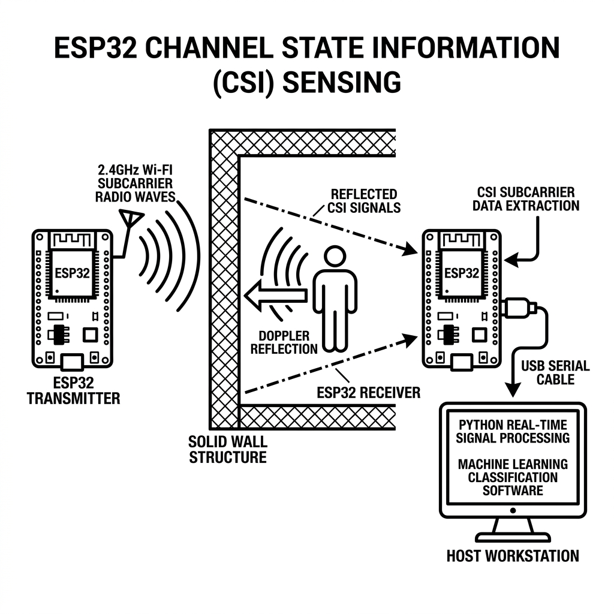
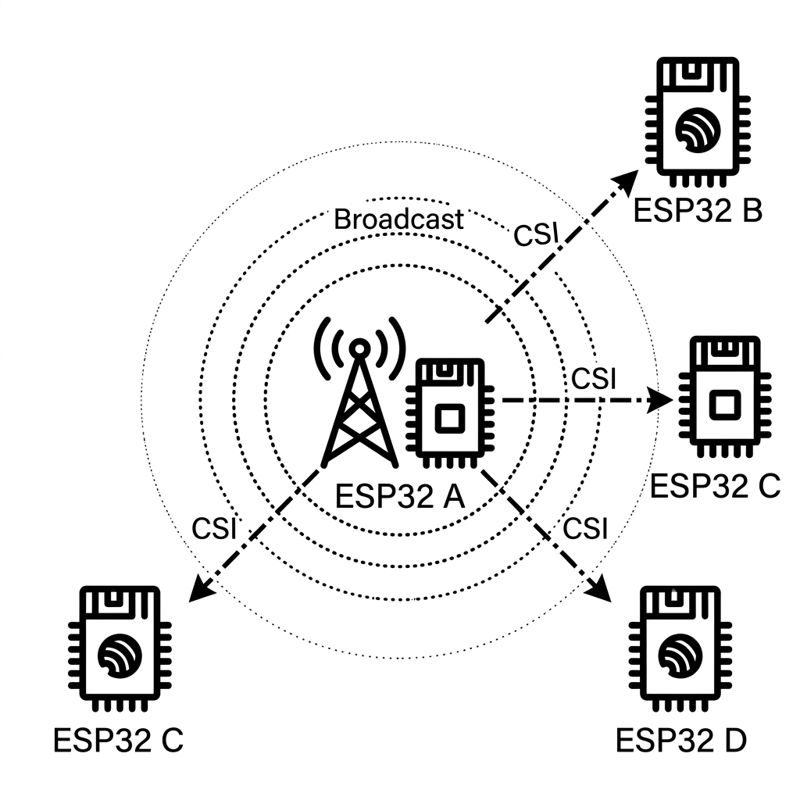
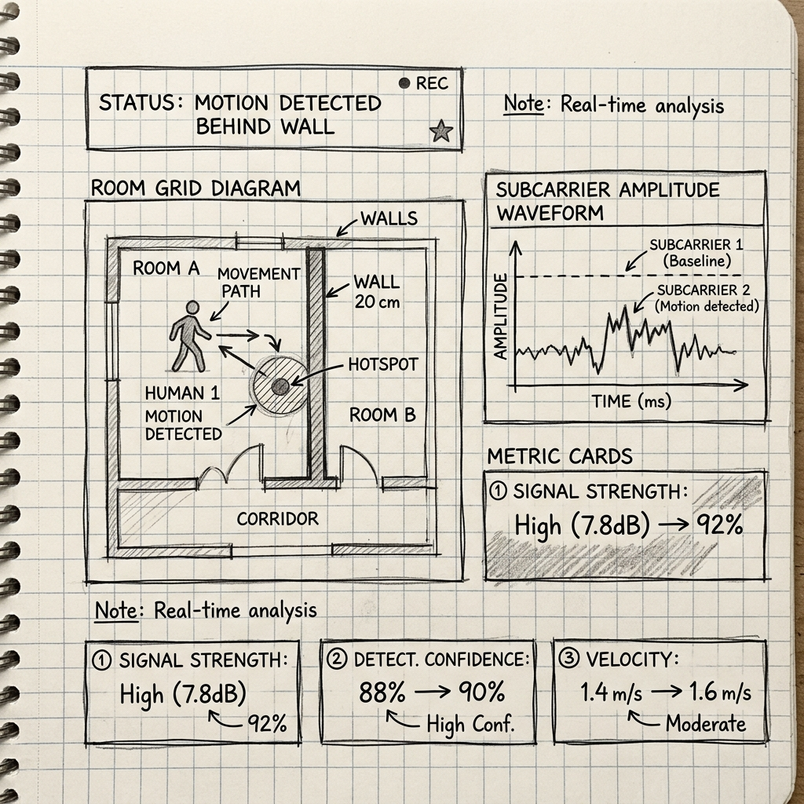

# Complete System Architecture & Signal Flow Guide

This document provides a detailed breakdown of the **Crispy Chainsaw** through-wall Wi-Fi presence and motion sensing framework.

---

## 1. Physical Hardware & Sensing Setup



### Hardware Components Breakdown:

1. **Transmitter Node (`ESP32 Tx`):**
   - Configured in SoftAP / Beacon broadcast mode emitting Wi-Fi OFDM packets (802.11 b/g/n @ 2.4 GHz) at a constant rate (e.g., 50 Hz to 100 Hz).
   - Directional antenna focuses radio waves directly toward the target wall.

2. **Target Sensing Area (Wall & Obstacle Zone):**
   - 2.4 GHz radio waves penetrate standard non-metallic obstacles (drywall, wood, brick, glass).
   - **Static Reflections:** Permanent structures (walls, furniture) bounce waves with constant phase and amplitude.
   - **Dynamic Reflection (Human Motion):** Human movement introduces micro-Doppler shifts, subcarrier attenuation, and multipath scattering.

3. **Receiver Node (`ESP32 Rx`):**
   - Subscribes to promiscuous / station mode packet reception.
   - Leverages Espressif's native `esp_wifi_set_csi_rx_cb()` API to capture raw Channel State Information (`wifi_csi_info_t`) matrices for each received packet.
   - Extracts amplitude $|H_i|$ and phase $\angle H_i$ across 52 subcarrier channels.

4. **Host Workstation (`PC / Laptop`):**
   - Connected to ESP32 Rx via high-speed USB-to-UART Serial (115200 / 921600 baud rate).
   - Executes real-time Python logging, clutter filtering, feature extraction, and ML inference.

---

## 2. Wi-Fi CSI Communication Topologies

### A. Broadcast CSI Extraction Topology


- **Central Beacon Broadcast (`ESP32 A`):** A single master transmitter broadcasts Wi-Fi beacon packets.
- **Multiple Receiver Nodes (`ESP32 B`, `ESP32 C`, `ESP32 D`):** Surrounding receivers simultaneously capture subcarrier CSI data without sending active reply traffic. This enables multi-room spatial coverage.

### B. Active Ping & Router Extraction Topology


- **Router / Access Point Integration:** An ESP32 node sends ICMP Ping requests to a standard home Wi-Fi router.
- **Bi-directional Measurement:** As the router transmits Ping Reply packets back, the ESP32 captures CSI measurements directly from existing network traffic.

---

## 3. End-to-End Signal Processing & ML Pipeline

```
  ┌────────────────────────────────────────────────────────┐
  │ 1. Raw ESP32 CSI Packet Ingestion                      │
  │    Extract OFDM Subcarrier Matrix (52 Subcarriers)    │
  └───────────────────────────┬────────────────────────────┘
                              │
                              ▼
  ┌────────────────────────────────────────────────────────┐
  │ 2. Phase Sanitization & Noise Removal                  │
  │    Correct Phase Linear Drift & Subcarrier Outliers    │
  └───────────────────────────┬────────────────────────────┘
                              │
                              ▼
  ┌────────────────────────────────────────────────────────┐
  │ 3. Static Clutter Removal (Butterworth Filter)         │
  │    Apply 4th-Order Bandpass Filter (0.2 Hz - 10 Hz)    │
  │    Strips Static Wall Reflections (DC Offset)          │
  └───────────────────────────┬────────────────────────────┘
                              │
                              ▼
  ┌────────────────────────────────────────────────────────┐
  │ 4. Feature Extraction & PCA Reduction                  │
  │    Extract Variance, Subcarrier Standard Deviation     │
  └───────────────────────────┬────────────────────────────┘
                              │
                              ▼
  ┌────────────────────────────────────────────────────────┐
  │ 5. Machine Learning Classification                     │
  │    Random Forest / SVM Classifier Model                │
  └───────────────────────────┬────────────────────────────┘
                              │
                              ▼
  ┌────────────────────────────────────────────────────────┐
  │ 6. Real-Time Detection Output                          │
  │    Output: EMPTY ROOM vs MOTION DETECTED BEHIND WALL   │
  └────────────────────────────────────────────────────────┘
```

---

## 4. Key Python Modules Reference

- **`python/serial_collector.py`**: Reads live raw CSI matrices over UART serial port and logs annotated dataset streams to CSV.
- **`python/preprocess.py`**: Implements 4th-order Butterworth bandpass filtering (0.2 Hz – 10 Hz) and PCA noise reduction.
- **`python/real_time_plotter.py`**: Renders live subcarrier amplitude waveforms and frequency spectrum heatmaps.
- **`python/train_classifier.py`**: Trains Random Forest / SVM classifiers on collected dataset CSVs and outputs serialized `.pkl` models.
